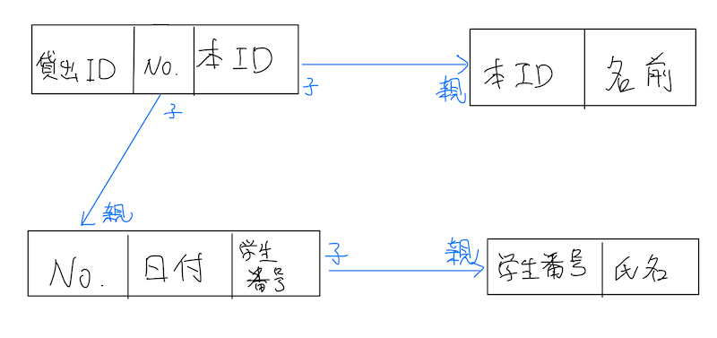

## データベースの正規化メモ

第一正規化、第二正規化、第三正規化までを実行する。

以下の書籍を参考にした

[https://gihyo.jp/book/2021/978-4-297-12453-3](https://gihyo.jp/book/2021/978-4-297-12453-3)

[https://book.impress.co.jp/books/1120101175](https://book.impress.co.jp/books/1120101175)

### 第一正規化

一つのフィールドには一つの値だけになるよう表の行を増やす。
| No. | 貸出日 | 学生番号(人ID) | 氏名 | 書籍ID | 本の名前 |
| --- | --- | --- | --- | --- | --- |
| 1 | 4/1 | 1 | 山田 | 1001 | XXX |
| 2 | 4/1 | 1 | 山田 | 1002 | YYY |
| 3 | 4/1 | 1 | 山田 | 1003 | ZZZ |
| 4 | 4/31 | 2 | 高橋 | 1004 | AAA |
| 5 | 5/31 | 3 | 吉田 | 1005 | BBB |

### 第二正規化

部分関数従属に注目してテーブルを切り出す。
3つに分割する
| No.  | 本ID |

| No. | 日付 | 学生番号 | 氏名 |

| 貸出ID | 本ID | 本の名前 |

### 第三正規化

主キー以外の列に関数従属している列を切り出す。

第二正規化した3つのテーブルのうち、学生番号と氏名が関数従属の関係にある。

さらに、貸出IDを追加し、貸出情報の番号付を行った。
よって、以下の4つにテーブルを分割できる。

1. 貸出ID | No. | 本ID 
2. No. | 日付 | 学生番号 
3. 学生番号 | 氏名
4. 本ID | 本の名前

